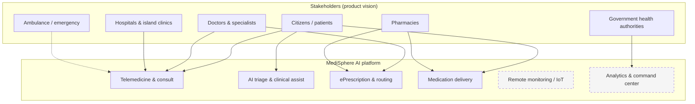
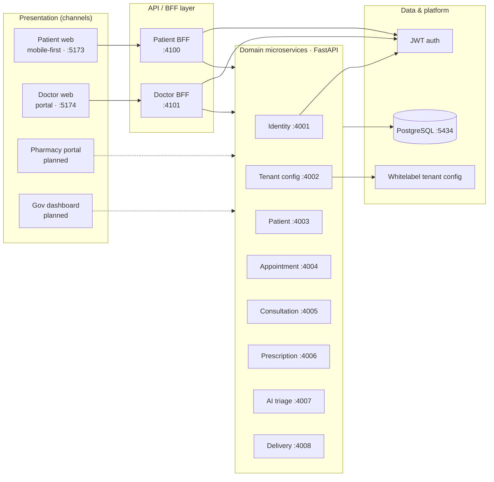
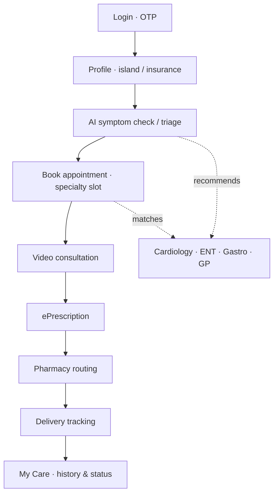
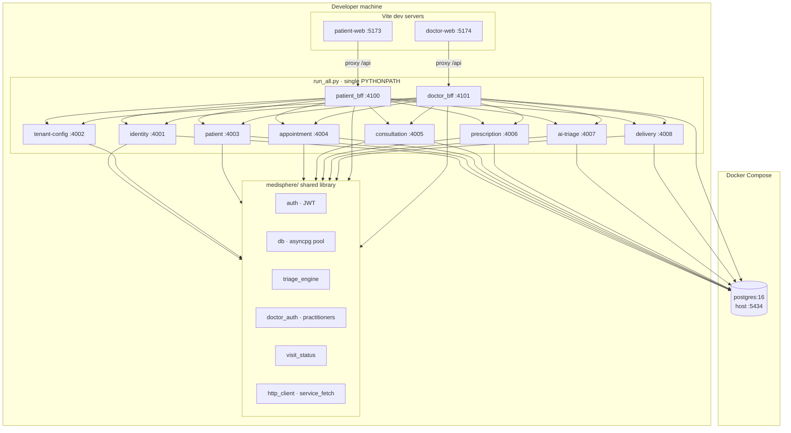
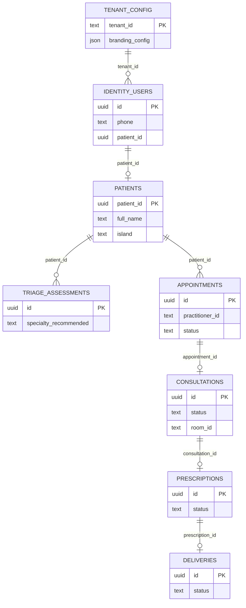
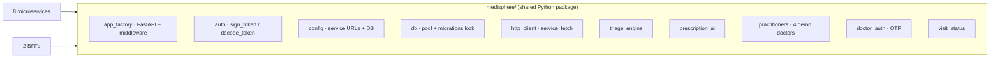

# MediSphere AI — Architecture

Architecture for **MediSphere AI**: unified telemedicine for island healthcare. This document covers the **product vision** (from [planning-discussion.md](./planning-discussion.md)) and what the **[prototype](../prototype/)** implements today.

**Runnable prototype:** see [prototype/README.md](../prototype/README.md) for ports, setup, and golden-path demo.

### PNG exports

| Diagram | File |
|---------|------|
| High-level | [diagrams/high-level-architecture.png](./diagrams/high-level-architecture.png) |
| Low-level | [diagrams/low-level-architecture.png](./diagrams/low-level-architecture.png) |

Source (Mermaid): [diagrams/high-level-architecture.mmd](./diagrams/high-level-architecture.mmd), [diagrams/low-level-architecture.mmd](./diagrams/low-level-architecture.mmd). Regenerate with:

```bash
cd Planning-Docs/diagrams
npx -y @mermaid-js/mermaid-cli -i high-level-architecture.mmd -o high-level-architecture.png -b white -w 2800
npx -y @mermaid-js/mermaid-cli -i low-level-architecture.mmd -o low-level-architecture.png -b white -w 2800
```


---

## High-level architecture

### 1. Product context & stakeholders



*Dashed: planned in product docs; not in the current prototype.*

---

### 2. Logical layers (channel → orchestration → domain)



**Design principles**

| Principle | How it shows up |
|-----------|------------------|
| **BFF per channel** | Patient and doctor UIs talk only to their BFF; BFF aggregates calls and shapes DTOs for the golden path. |
| **Domain-owned data** | Each service owns its tables and migrations (`schema_migrations` per service). |
| **Multi-tenant / whitelabel** | `tenant-config-service` supplies logo, title, copy per tenant (`demo-maldives`). |
| **AI-assisted, human-centered** | Triage and Rx recommendations assist; doctor signs prescriptions. |

---

### 3. Patient golden path (business flow)



**Doctor path (parallel):** login → schedule → visit detail → consult → prescribe → complete.

---

## Low-level architecture

### 4. Runtime deployment (prototype)



**Inter-service transport:** synchronous **HTTP/JSON** via `httpx` (`service_fetch`), Bearer JWT on protected routes.

**Observability (each service):** `/health`, `/ready`, `/metrics`, `/version`.

---

### 5. Service responsibilities & data ownership



| Service | Port | Owns | Primary APIs (conceptual) |
|---------|------|------|---------------------------|
| **identity** | 4001 | `identity_users`, `identity_otp` | Patient OTP; doctor directory; link user ↔ patient |
| **tenant-config** | 4002 | `tenant_config` | Whitelabel branding per tenant |
| **patient** | 4003 | `patients` | CRUD profile |
| **appointment** | 4004 | `appointments` | Slots, book, practitioner schedule |
| **consultation** | 4005 | `consultations` | Start/join/complete visit (prototype room IDs) |
| **prescription** | 4006 | `prescriptions` | Recommend, sign, route to pharmacy |
| **ai-triage** | 4007 | `triage_assessments` | Symptom assessment API (patient UI also uses client-side engine) |
| **delivery** | 4008 | `deliveries` | Fulfillment status chain |
| **patient-bff** | 4100 | — (stateless) | Golden-path orchestration, `visitStatus`, My Care bundles |
| **doctor-bff** | 4101 | — (stateless) | Schedule aggregation, doctor OTP (`doctor_auth`), consult/Rx flows |

**Unified visit state:** `medisphere/visit_status.py` derives `visitStatus` (`booked` → `ready` → `in_progress` → `awaiting_rx` → `completed`) from appointment + consultation + prescription for both portals.

---

### 6. Request flow — book & consult (sequence)

```mermaid
sequenceDiagram
    actor Patient as Patient UI :5173
    participant PBFF as Patient BFF :4100
    participant ID as Identity :4001
    participant PT as Patient :4003
    participant TR as AI Triage :4007
    participant AP as Appointment :4004
    actor Doctor as Doctor UI :5174
    participant DBFF as Doctor BFF :4101
    participant CN as Consultation :4005
    participant RX as Prescription :4006
    participant DL as Delivery :4008

    Patient->>PBFF: POST /auth/otp/*
    PBFF->>ID: OTP request/verify
    ID-->>Patient: JWT (patient)

    Patient->>PBFF: POST /patients/profile
    PBFF->>PT: create/update patient
    PBFF->>ID: link patientId to user

    Patient->>PBFF: POST /triage (symptoms)
    PBFF->>TR: save assessment
    Note over Patient: Client triageChat also runs locally

    Patient->>PBFF: POST /appointments/book
    PBFF->>AP: book slot (specialty)

    Doctor->>DBFF: POST /auth/otp/* (doctor_auth + DB)
    Note over DBFF: Uses practitioners registry; not identity-only list

    Doctor->>DBFF: GET /schedule
    DBFF->>AP: practitioner appointments
    DBFF->>PT: patient names
    DBFF->>CN: consultation by appointment
    DBFF-->>Doctor: aggregated schedule cards

    Patient->>PBFF: POST /consultations/join
    PBFF->>CN: join room
    Doctor->>DBFF: POST /consultations/start|join
    DBFF->>CN: doctor side

    Doctor->>DBFF: POST /prescriptions
    DBFF->>RX: sign & route
    DBFF->>AP: mark completed
    Patient->>PBFF: GET /care/appointments/{id}
    PBFF->>AP & CN & RX & DL: bundle for My Care detail
```

---

### 7. Shared kernel (`medisphere/`)



---

## Scope summary

| Layer | In prototype today | Planned (planning docs) |
|-------|--------------------|-------------------------|
| **Channels** | Patient web, Doctor web | Pharmacy portal, Government dashboard, native mobile |
| **Realtime** | Prototype consult “rooms” (not full WebRTC stack) | Secure WebRTC, Tele-ICU |
| **AI** | Rule/keyword triage + Rx suggest | Richer models, outbreak analytics |
| **Integrations** | Demo OTP, local Postgres | National ID, insurance, GPS courier, wearables |
| **Ops** | `run_all.py`, Docker DB only | Full K8s / per-service containers in production |

---

## Related documents

- [planning-discussion.md](./planning-discussion.md) — product objectives, modules, 30-minute demo scenario
- [../prototype/README.md](../prototype/README.md) — setup, ports, appointment/visit statuses
